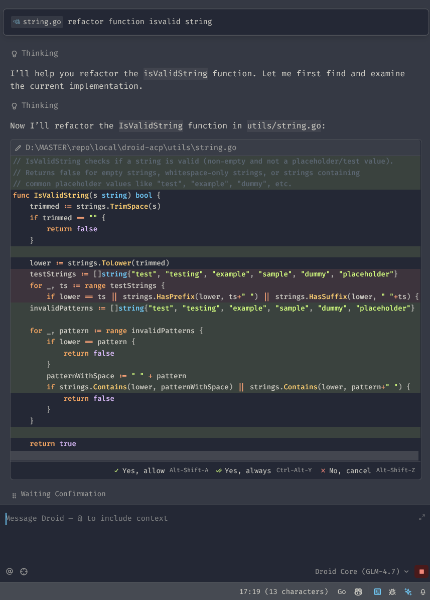

Droid ACP ( Droid Unofficial ACP connector for Zed Editor )
=========



Build
-----
1. Open this repository in a terminal and run `go build .`.
2. The command produces the `droid-acp` binary (Windows: `droid-acp.exe`) in the current working directory.

Add to Environment Variables
----------------------------
1. Choose a directory for the binary (example: `C:\Tools\droid-acp`).
2. Move the build output into that directory.
3. Add the directory to `PATH` via **System Environment Variables** so any CLI can find `droid-acp`.
4. Verify by opening a new terminal and running `droid-acp -v`

Configure Zed
-------------
Make sure Zed knows how to call this agent. Add the following snippet to `settings.json` (see `C:\Users\{user}\AppData\Roaming\Zed\settings.json`):

```json
  "agent_servers": {
    "Droid": {
      "type": "custom",
      "command": "droid-acp"
    }
  }
```

Once the binary is on PATH, Zed can invoke `droid-acp` directly through the CLI.

Status
------
The project is still under active development. Some features remain incomplete—for example, edit permissions are not wired up yet because we are missing details from the Droid JSON-RPC responses. Expect rough edges while the protocol integration stabilizes.
